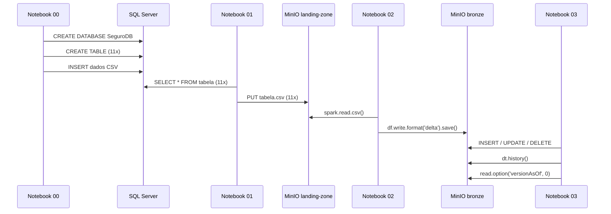

# Visão Geral da Arquitetura

## Diagrama do Pipeline

```
┌─────────────────────────────────────────────────────────────────────────┐
│                         PIPELINE DE DADOS                               │
│                                                                         │
│  ┌──────────────┐    ┌──────────────────────┐    ┌────────────────────┐ │
│  │  SQL Server  │    │    MinIO (S3)        │    │    MinIO (S3)      │ │
│  │  2022 Dev    │───▶│    landing-zone/     │───▶│    bronze/         │ │
│  │              │    │                      │    │                    │ │
│  │  SeguroDB    │    │  regiao.csv          │    │  regiao/           │ │
│  │  11 tabelas  │    │  estado.csv          │    │  estado/           │ │
│  │              │    │  municipio.csv       │    │  municipio/        │ │
│  │  ~180 linhas │    │  marca.csv           │    │  marca/            │ │
│  │              │    │  modelo.csv          │    │  modelo/           │ │
│  └──────────────┘    │  cliente.csv         │    │  cliente/          │ │
│                      │  endereco.csv        │    │  endereco/         │ │
│   Notebook 00        │  telefone.csv        │    │  telefone/         │ │
│   (Setup)            │  carro.csv           │    │  carro/            │ │
│                      │  apolice.csv         │    │  apolice/          │ │
│   Notebook 01        │  sinistro.csv        │    │  sinistro/         │ │
│   (Extração)         └──────────────────────┘    └────────────────────┘ │
│                                                                         │
│                           Notebook 02              Notebook 03          │
│                           (CSV→Delta)              (DML+History)        │
└─────────────────────────────────────────────────────────────────────────┘
```

## Componentes

### Fonte de Dados — SQL Server 2022

O banco **SeguroDB** simula o sistema de uma seguradora de veículos com 11 tabelas relacionais. Roda em container Docker com a edição Developer (gratuita para desenvolvimento).

### Landing Zone — MinIO (CSV)

Primeira camada de armazenamento. Os dados extraídos do SQL Server são salvos como arquivos CSV no bucket `landing-zone`. Esta camada representa os **dados brutos** — exatamente como saem da fonte, sem transformações.

**Por que CSV?** Para banco de dados relacional, CSV é o formato padrão de intercâmbio. É legível por humanos, compatível com qualquer ferramenta e preserva a estrutura tabular original.

### Bronze — MinIO (Delta Lake)

Segunda camada. Os CSVs são lidos pelo Apache Spark e gravados em formato Delta Lake no bucket `bronze`. Esta camada garante:

- **ACID** — transações atômicas e consistentes
- **Schema enforcement** — validação de tipos de dados
- **Versionamento** — histórico completo de cada alteração
- **Time Travel** — capacidade de consultar versões anteriores

## Fluxo de Dados Detalhado


